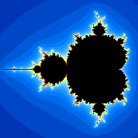
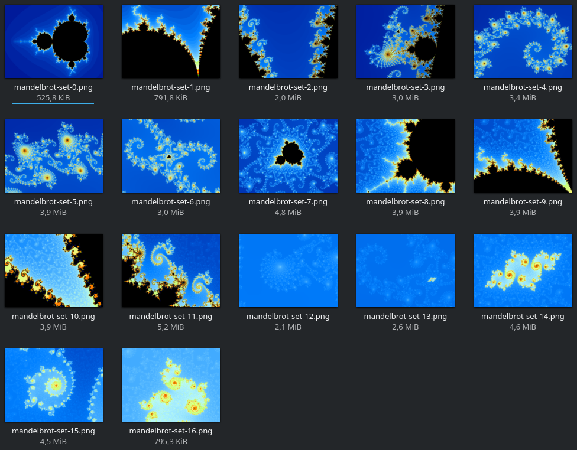
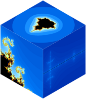

# fractal-kt-native

Demonstrates how to use Kotlin Native to generate fractals (specifically the
[Mandelbrot set](https://en.wikipedia.org/wiki/Mandelbrot_set)).

## How to build?

Use Gradle:

`./gradlew build`

## How to use?

Execute the resulting `build/bin/linuxX64/releaseExecutable/fractal-generator.kexe`.
The application will output a PNG on stdout,
so redirect stdout to a file or pipe into a program, for example `display`.

There is no user-friendly usage (`-?` or `--help`) yet.
Here are all the options:

- `-s 300x200`: Sets the size of the resulting image
- `-c -0.5,0`: Sets the center coordinates to render
- `-z 20`: Sets the zoom level, e.g. how deep to dive into the Mandelbrot set
- `-t 50`: Sets the threshold for the algorithm,
           i.e. if `abs(z) > threshold` we assume the sequence diverges to infinity.
- `-i 25`: Sets the maximum number of iterations for the algorithm,
           i.e. if we iterated this number times and the sequence still stays below the threshold,
           we assume the point is part of the Mandelbrot set.
- `-p`: Enables outputting the used options and a progress bar on stderr.
- `-x 4`: Sets the number of Kotlin Coroutines to use.
          Setting this to greater than 1 enables parallel calculation and therefore a speed-up.
          Don't set it greater as the number of CPU cores, it won't get any faster ;-)
- `-g "(255,0,0);(0,0,255)"`: Allows to override the default color gradient.
                              Separate multiple colors by `;`.

## Examples

### Demo picture



```shell
./fractal-generator.kexe -s 200x200 -c -0.7,0 -z 75 -p -i 50 -x 4 >demo.png
```

### Let's explore the Mandelbrot set



Views from [Wikipedia](https://en.wikipedia.org/wiki/Mandelbrot_set#Image_gallery_of_a_zoom_sequence):\
(had to tweak the values for center and zoom a little to get similar results)

```shell
./fractal-generator.kexe -s 2560x1920 -c -0.7,0 -z 810 -p -i 100 -x 32 >mandelbrot-set-0.png
./fractal-generator.kexe -s 2560x1920 -c -0.87591,0.20464 -z 5785 -p -i 100 -x 32 >mandelbrot-set-1.png
./fractal-generator.kexe -s 2560x1920 -c -0.759856,0.125547 -z 50000 -p -i 400 -x 32 >mandelbrot-set-2.png
./fractal-generator.kexe -s 2560x1920 -c -0.74303,0.126433 -z 165000 -p -i 750 -x 32 >mandelbrot-set-3.png
./fractal-generator.kexe -s 2560x1920 -c -0.7435669,0.1314023 -z 1250000 -p -i 750 -x 32 >mandelbrot-set-4.png
./fractal-generator.kexe -s 2560x1920 -c -0.7436499,0.13188204 -z 3600000 -p -i 800 -x 32 >mandelbrot-set-5.png
./fractal-generator.kexe -s 2560x1920 -c -0.74364085,0.13182733 -z 22500000 -p -i 850 -x 32 >mandelbrot-set-6.png
./fractal-generator.kexe -s 2560x1920 -c -0.743643135,0.131825963 -z 190000000 -p -i 2000 -x 32 >mandelbrot-set-7.png
./fractal-generator.kexe -s 2560x1920 -c -0.743644786,0.1318252536 -z 1700000000 -p -i 3250 -x 32 >mandelbrot-set-8.png
./fractal-generator.kexe -s 2560x1920 -c -0.74364409961,0.13182604688 -z 4000000000 -p -i 4500 -x 32 >mandelbrot-set-9.png
./fractal-generator.kexe -s 2560x1920 -c -0.74364386269,0.13182590271 -z 18000000000 -p -i 5250 -x 32 >mandelbrot-set-10.png
./fractal-generator.kexe -s 2560x1920 -c -0.743643900055,0.131825890901 -z 52000000000 -p -i 12500 -x 32 >mandelbrot-set-11.png
./fractal-generator.kexe -s 2560x1920 -c -0.7436438885706,0.1318259043124 -z 395000000000 -p -i 7500 -x 32 >mandelbrot-set-12.png
./fractal-generator.kexe -s 2560x1920 -c -0.74364388717342,0.13182590425182 -z 5100000000000 -p -i 8500 -x 32 >mandelbrot-set-13.png
./fractal-generator.kexe -s 2560x1920 -c -0.743643887037151,0.131825904205330 -z 5980000000000 -p -i 8500 -x 32 >mandelbrot-set-14.png
./fractal-generator.kexe -s 2560x1920 -c -0.7436438870357766659094695,0.1318259042107 -z 259800000000000 -p -i 15000 -x 32 >mandelbrot-set-15.png
./fractal-generator.kexe -s 2560x1920 -c -0.74364388703577,0.1318259042126275 -z 62259800000000000 -p -i 12500 -x 32 >mandelbrot-set-16.png                                 
```

The last picture shows the limits of the `double` precision:
Multiple points are mapped to the same number, leading to rectangular artifacts.

### Test generation time

```shell
time ./fractal-generator.kexe -s 1600x800 -z 22748000 -c -0.74364386269,0.13182590271 -p -i 2500 -x 32 >/dev/null
```

### Display generated image without saving it

```shell
./fractal-generator.kexe -s 1024x768 -z 22748000 -c -0.74364386269,0.13182590271 -p -i 750 | display
```

### Use custom colors

```shell
./fractal-generator.kexe \
  -s 1280x800 -z 127500 -c 0.3415632541092,-0.37595099964135 -p -i 750 \
  -g "(255,0,0);(255,255,0);(0,255,0);(0,0,255);(128,0,128)" \
  | display
```

### Apply a blur effect

```shell
./fractal-generator.kexe \
  -s 1920x1280 -z 167500 -c 0.3415632541092,-0.37595099964135 -p -i 750 \
  -g "(255,0,0);(255,255,0);(0,0,255)" \
  | convert - -blur 1x4 png:- \ 
  | display
```

### Save in a different format

```shell
./fractal-generator.kexe -s 800x600 -z 160 | convert - foo.gif
```

### Create a Mandelbrot cube



```shell
./fractal-generator.kexe -s 256x256 -c -0.5,0 -z 50 >cube1.png
./fractal-generator.kexe -s 256x256 -c -0.799,0.19 -z 5000 -i 150 >cube2.png
./fractal-generator.kexe -s 256x256 -c -1.7,0 -z 50000 -i 250 >cube3.png

convert \
  -background transparent \
  \( cube1.png -alpha set -virtual-pixel transparent +distort Affine '0,256 0,0   0,0   -87,-50   256,256 87,-50' \) \
  \( cube2.png -alpha set -virtual-pixel transparent +distort Affine '256,0 0,0   0,0   -87,-50   256,256 0,100' \) \
  \( cube3.png -alpha set -virtual-pixel transparent +distort Affine '0,0   0,0   0,256   0,100   256,0   87,-50' \) \
  -layers merge +repage cube.png
  
rm cube1.png cube2.png cube3.png
```

### Create a video

```bash
#!/bin/bash
for i in $(seq -f "%04g" 20 150)
do
  ./fractal-generator.kexe -s 320x200 -c -0.759856,0.125547 -z $i >frame$i.png
done

ffmpeg \
  -framerate 30 -pattern_type glob -i 'frame*.png' \
  -c:v libx264 -pix_fmt yuv420p \
  mandelbrot-video.mp4
  
rm frame*.png
```
